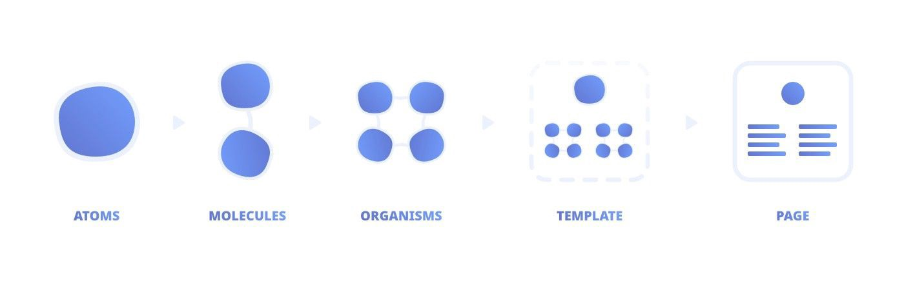

# tailwind design system

> "Design is not just what it looks like and feels like. Design is how it works."

Steve Jobs

> "A design system is the story of how your organization designs and builds digital products."

> "The heart and soul of a design system is a code library of reusable components that power real software applications."

Brad Frost, [The Technical side of Design Systems](https://www.youtube.com/watch?v=TgWyyoofKIA)

> "Design systems should empower developers & offer a common language with the designers for optimal collaboration."

[Building a “utility-first” design system (part 1)](https://uxdesign.cc/building-utility-first-design-systems-part-1-52ce020630b)

## pros

> "Tailwind is more than a CSS framework, it's an engine for creating design systems."

https://v1.tailwindcss.com/

> "By adopting the utility-first CSS methodology & Tailwind’s configuration file, designers get a clear structure for their design systems while developers can swiftly work with the generated classes without adding new CSS."

[Design systems after Tailwind](https://medium.com/@tholex/design-systems-after-tailwind-2513daebcedc)

## cons

Don't use Tailwind for your Design System
https://sancho.dev/blog/tailwind-and-design-systems/

## Atomic Design


The five stages of Atomic Design are atoms, molecules, organisms, templates, and pages.




> "Atomic design provides a clear methodology for crafting design systems. Clients and team members are able to better appreciate the concept of design systems by actually seeing the steps laid out in front of them.

> "Atomic design gives us the ability to traverse from abstract to concrete. Because of this, we can create systems that promote consistency and scalability while simultaneously showing things in their final context. And by assembling rather than deconstructing, we’re crafting a system right out of the gate instead of cherry picking patterns after the fact."

Brad Frost https://bradfrost.com/blog/post/atomic-web-design/


<hr>


This is a [Next.js](https://nextjs.org/) project bootstrapped with [`create-next-app`](https://github.com/vercel/next.js/tree/canary/packages/create-next-app).

## Getting Started

First, run the development server:

```bash
npm run dev
# or
yarn dev
```

Open [http://localhost:3000](http://localhost:3000) with your browser to see the result.

You can start editing the page by modifying `pages/index.tsx`. The page auto-updates as you edit the file.

[API routes](https://nextjs.org/docs/api-routes/introduction) can be accessed on [http://localhost:3000/api/hello](http://localhost:3000/api/hello). This endpoint can be edited in `pages/api/hello.ts`.

The `pages/api` directory is mapped to `/api/*`. Files in this directory are treated as [API routes](https://nextjs.org/docs/api-routes/introduction) instead of React pages.

## Learn More

To learn more about Next.js, take a look at the following resources:

- [Next.js Documentation](https://nextjs.org/docs) - learn about Next.js features and API.
- [Learn Next.js](https://nextjs.org/learn) - an interactive Next.js tutorial.

You can check out [the Next.js GitHub repository](https://github.com/vercel/next.js/) - your feedback and contributions are welcome!

## Deploy on Vercel

The easiest way to deploy your Next.js app is to use the [Vercel Platform](https://vercel.com/new?utm_medium=default-template&filter=next.js&utm_source=create-next-app&utm_campaign=create-next-app-readme) from the creators of Next.js.

Check out our [Next.js deployment documentation](https://nextjs.org/docs/deployment) for more details.
